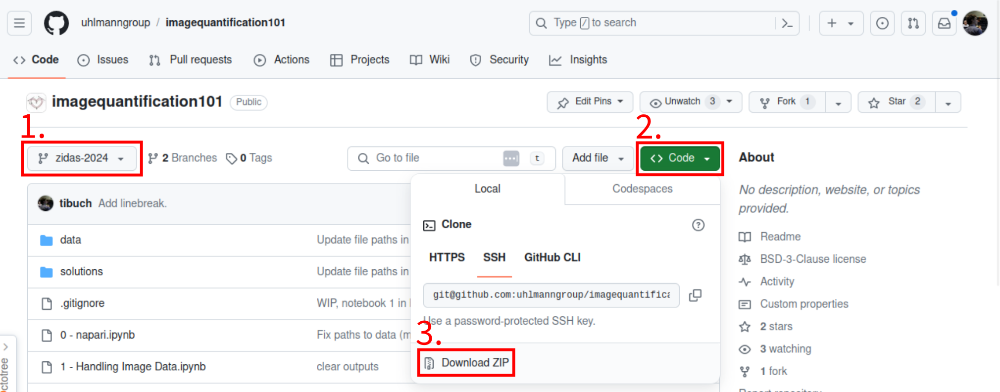

# Image Quantification 101

## Python Setup

To ensure a smooth start into the Python session at ZIDAS 2024 we require you to prepare a conda environment. A conda environment is a special directory which contains all required dependencies to run Python and follow the planned Python session. Luckily you don't have to create this environment by hand. We will use the conda package manager to build the environment. If you have anaconda or miniforge already installed on your computer you can skip the first part and directly move on to the environment creation. Otherwise follow the miniforge install instructions first.

### Install miniforge
Miniforge is our recommended environment manager for Python environments. Please download the version which fits your operation system from [here](https://github.com/conda-forge/miniforge?tab=readme-ov-file#download) and follow the respective install instructions:
* [Windows](https://github.com/conda-forge/miniforge?tab=readme-ov-file#windows)
* [MacOS with Homebrew](https://github.com/conda-forge/miniforge?tab=readme-ov-file#homebrew)
* [MacOS & Linux](https://github.com/conda-forge/miniforge?tab=readme-ov-file#windows)

On MacOS and Linux close the terminal and reopen a new one. On Windows look for `Miniforge Prompt` in the start menu. 

You should be able to type `conda` into your terminal/Miniforge Prompt and see the following output:
```
usage: conda [-h] [-v] [--no-plugins] [-V] COMMAND ...

conda is a tool for managing and deploying applications, environments and packages.

options:
  -h, --help          Show this help message and exit.
  -v, --verbose       Can be used multiple times. Once for detailed output, twice for INFO logging, thrice for DEBUG logging, four times for TRACE logging.
  --no-plugins        Disable all plugins that are not built into conda.
  -V, --version       Show the conda version number and exit.

commands:
  The following built-in and plugins subcommands are available.

  COMMAND
    activate          Activate a conda environment.
    clean             Remove unused packages and caches.
    compare           Compare packages between conda environments.
    config            Modify configuration values in .condarc.
    create            Create a new conda environment from a list of specified packages.
    deactivate        Deactivate the current active conda environment.
    doctor            Display a health report for your environment.
    env               See `conda env --help`.
    info              Display information about current conda install.
    init              Initialize conda for shell interaction.
    install           Install a list of packages into a specified conda environment.
    list              List installed packages in a conda environment.
    notices           Retrieve latest channel notifications.
    package           Create low-level conda packages. (EXPERIMENTAL)
    remove (uninstall)
                      Remove a list of packages from a specified conda environment.
    rename            Rename an existing environment.
    repoquery         Advanced search for repodata.
    run               Run an executable in a conda environment.
    search            Search for packages and display associated information using the MatchSpec format.
    update (upgrade)  Update conda packages to the latest compatible version.

```

### Create ZIDAS2024 Environment
Downlaod this GitHub repository:

1. Click on the green `Code` button.
2. Click on `Download ZIP`.
3. Unpack the downloaded ZIP file.

From inside your open terminal or Minifroge Prompt change into the unpacked directory. If you extracted the setup material in your `Downloads` directory you would now change to `Downloads/imagequantification101-main`.

__Windows:__ `dir Downloads/imagequantification101-main`
__MacOS/Linux:__ `cd Downloads/imagequantification101-main`

Now we can create the environment with conda from the `zidas2024_env.yaml` file. Run the following command:
```commandline
conda env create -f zidas2024_env.yaml
```

Executing this command might take some time, but once it finishes you should see the following:
```
Downloading and Extracting Packages:

Preparing transaction: done
Verifying transaction: done
Executing transaction: done
```

To verify that everything worked run the following two commands:
```
conda activate zidas2024
napari
```

This should open the napari viewer after a little bit of waiting time. 

## To cite
If you use the exercise notebooks from this tutorial, please acknowledge it as follows:

Buchholz, T.-O., Witz, G., Uhlmann, V. (2024). Image Quantification 101 Tutorial. github.com/uhlmanngroup/imagequantification101

## Further resources
* Miura, K. & Sladoje, N. (2020). Bioimage Data Analysis Workflows. doi.org/10.1007/978-3-030-22386-1
* Bankhead, P. (2022). Introduction to Bioimage Analysis. bioimagebook.github.io
* Holmes, S. & Huber, W. (2018). Modern Statistics for Modern Biology. www.huber.embl.de/msmb

## Acknowledgements
Part of the material from this tutorial was adapted from Paula Balcells' Bachelor Thesis work carried out in the Uhlmann group.
